
<h1> 自动化科技评价学</h1>

## RoadMap

1. Github直接可见的关系，包括`fork` `submodule` ~~依赖关系~~  ~~镜像关系~~；lable：image_generation, text2image.
2. Github的Dependency Graph提供dependencies和dependents；
3. 分析README和description（使用正则表达式/nlp工具/大模型/Embedding）；
4. 代码中的copyright(R)；
5. 函数调用频率；（使用AST？）

---

fork 关系：应该删除所有同名仓库

---

按照topics构建

> 1. 获取topic"image-generation"下的所有仓库（先筛选所有stars>2000的）
> 2. 获取这些仓库所有的fork关系（包括fork和被fork）
> 3. 获取这些仓库所有的submodule关系（包括使用submodule和被作为submodule使用）
> 4. 获取这些仓库所有的README文件

[Dependency graph supported package ecosystems - GitHub Docs](https://docs.github.com/en/code-security/supply-chain-security/understanding-your-software-supply-chain/dependency-graph-supported-package-ecosystems#supported-package-ecosystems)

[REST API endpoints for software bill of materials (SBOM) - GitHub Docs](https://docs.github.com/en/rest/dependency-graph/sboms?apiVersion=2022-11-28#export-a-software-bill-of-materials-sbom-for-a-repository)

[About CodeQL ― CodeQL](https://codeql.github.com/docs/codeql-overview/about-codeql/)

[N/A 自动化依赖管理工具 -  Dependabot supported ecosystems and repositories - GitHub Docs](https://docs.github.com/en/code-security/dependabot/ecosystems-supported-by-dependabot/supported-ecosystems-and-repositories)

---

---

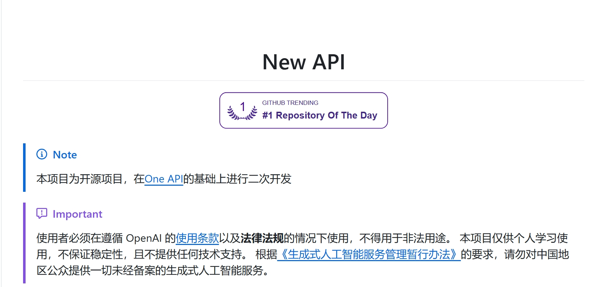

---

## OldRoadMap

做一个小bench

Q: 使用现有数据库 or 新建数据库？

> 做一个小bench最好利用现有的论文数据库，例如Semantic Scholar，新建数据库/知识图谱可能成本较高。

Q: TD or DT?

> TD：从一篇开拓性论文，遍历所有引用此论文的文章
>
> 优点：操作简单；
>
> 缺点：1) 开拓性节点往往是高被引论文，引用的太多；2) 很多论文不是直接来自其引用的论文; 3) 可能来自不同领域
>
> DT：从较新论文开始，根据其引用，寻找其上级节点
>
> 优点：每次只需要考虑几十个引用，可以利用论文的信息；
>

---

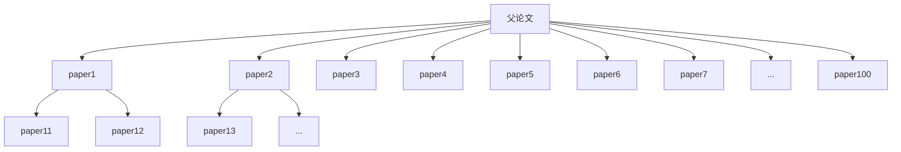

---

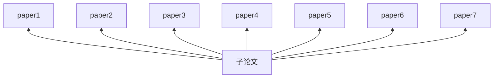

---

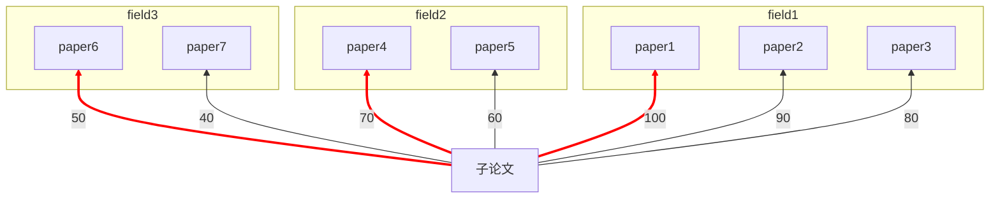

---

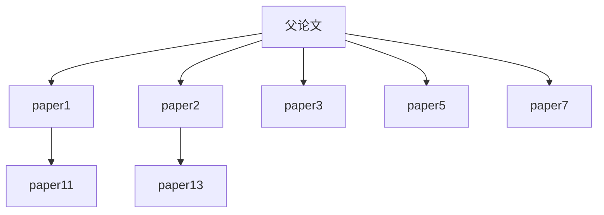

---

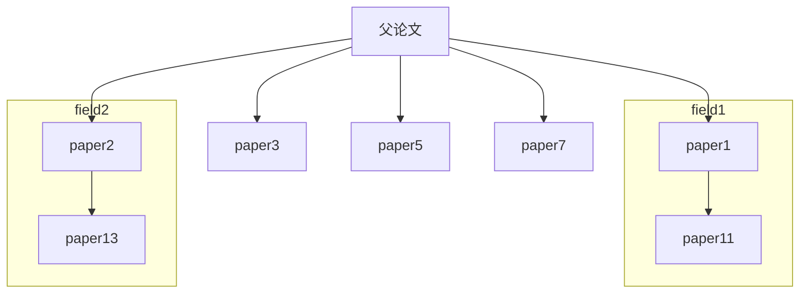

---

---

<!--谷歌学术可以搜索相关论文-->

对于特定研究领域（例如Language Model，来自ACM Computing Classification System）

1. 寻找开拓性节点（作为根节点）
2. 生成排序树

如何 (1) 寻找开拓性节点：

> 选择若干个此领域的论文使用溯源树算法，寻找其相交点

如何 (2) 生成排序树

> 确定筛选条件，例如高于此引用数的论文才去排序
>
> 对于特定领域的论文筛选

<!--对于高引用树进行聚类？（如果使用K-means聚类，会不会导致其邻接矩阵太太？）-->

---

排序树和溯源树是相反的：

> 溯源树是以边缘的节点为根节点向上追溯
>
> 排序树是由领域的开拓性节点为根节点向下追溯

## Related Work

[AMiner - MRT溯源树](https://mrt.aminer.cn/)

---

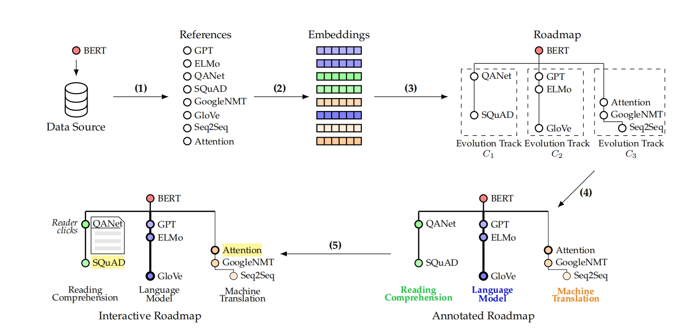

---

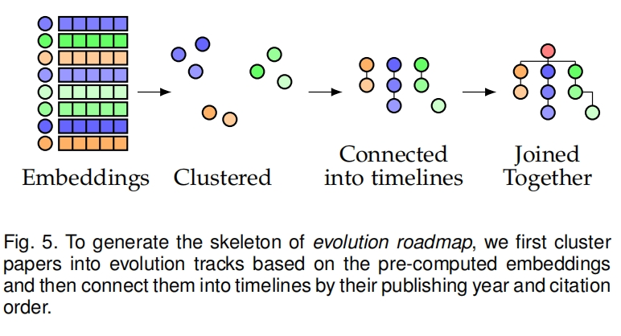

### Github

GitHub's main features---namely commits, pull requests, and issues

[Influence analysis of Github repositories | SpringerPlus](https://link.springer.com/article/10.1186/s40064-016-2897-7)

#### GithubAPI调用

[Getting started with the REST API - GitHub Docs](https://docs.github.com/en/rest/using-the-rest-api/getting-started-with-the-rest-api?apiVersion=2022-11-28)

[PyGithub/PyGithub: Typed interactions with the GitHub API v3](https://github.com/PyGithub/PyGithub)

## ToDo

能不能利用现有的图融合算法？

什么规模？融合困难？

能否使用大模型few-shot？

<!--1990-2000某一领域TOP50-->

<!--找一些同质的工作-->

<!--scikg技术细节-->

<!--寻找其技术更新（查看唐杰谷歌学术）-->

<!--开源程度-->

<h1> LLM-augmented KGs</h1>

- **LLM-augmented KG Embedding**
- LLM-augmented KG Completion 
  - *（关系由少到多。考虑反向：由多到少）*
- LLM-augmented KG-to-Text Generation
- LLM-augmented KG Question Answering

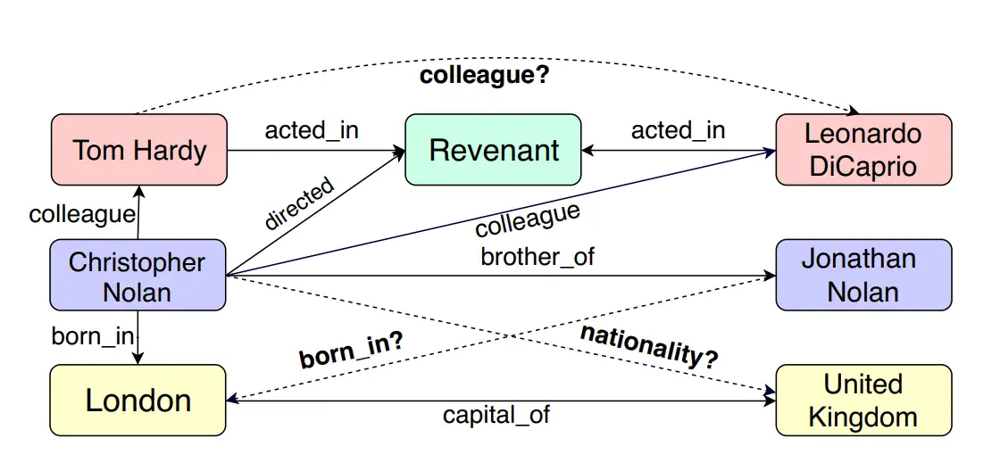

## KG Embedding

知识图谱嵌入 (KG Embedding)

> 知识图谱嵌入是将知识图谱中的实体和关系映射到低维连续向量空间的技术。
>
> 主要特点:
>
> 目的: 将离散的符号表示转化为连续的向量表示	
>
> 优势: 能够捕捉实体和关系之间的语义相似性
>
> 应用: 为下游任务如链接预测、实体分类等提供输入
>
> 常见方法:
>
> TransE: 将关系视为实体间的平移操作
>
> DistMult: 使用双线性积分模型
>
> ComplEx: 在复数空间中进行嵌入
>
> RotatE: 将关系视为复平面上的旋转

---

> FROM.
> 《Language Model Guided Knowledge Graph Embeddings》
>
> Various link prediction approaches have been proposed to tackle the incompleteness of KGs, among which link prediction using knowledge graph embeddings (KGE) has become popular for KG completion tasks.

KGE是实现KGC的一种手段

## KG Completion

知识图谱补全 (KG Completion)

> 知识图谱补全旨在预测和添加知识图谱中缺失的实体或关系,从而扩展和完善知识图谱。
>
> 主要特点:
>
> 目的: 发现和填补知识图谱中的缺失信息
>
> 挑战: 处理大规模、稀疏的知识图谱
>
> 应用: 知识库扩展、问答系统、推荐系统等
>
> 常见方法:
>
> 基于嵌入的方法: 利用KG嵌入进行链接预测
>
> 基于规则的方法: 使用逻辑规则进行推理
>
> 基于路径的方法: 分析实体间的关系路径
>
> 神经网络方法: 使用图神经网络或注意力机制

---

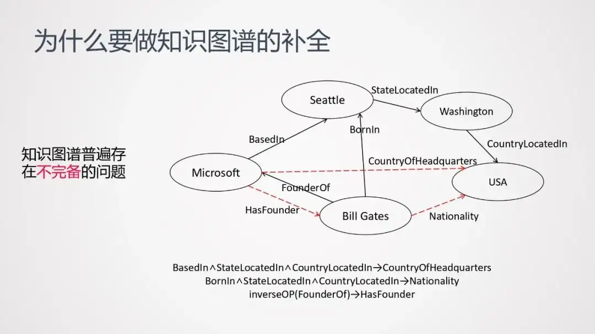

## LLM-augmented KG Embedding

- Language Model Guided Knowledge Graph Embeddings (IEEE Access, 2022) [[paper\]](https://ieeexplore.ieee.org/stamp/stamp.jsp?tp=&arnumber=9831788)

---

## LLM-augmented KG Completion

Multi-perspective Improvement of Knowledge Graph Completion with Large Language Models (COLING 2024) [[paper\]](https://arxiv.org/abs/2403.01972) [[Code\]](https://github.com/quqxui/MPIKGC)<!--此论文比较说人话-->

> + structure-based KGC
>
> +  description-based KGC
>
>   The plausibility of facts is predicted by computing a scoring function of triplet or matching semantic similarity between the [head entity, relation] and tail entity.
>
>   In this way, the textual encoder facilitates easy generalization of the model to unseen graph entities, resulting in better scalability than index entity embedding.

---

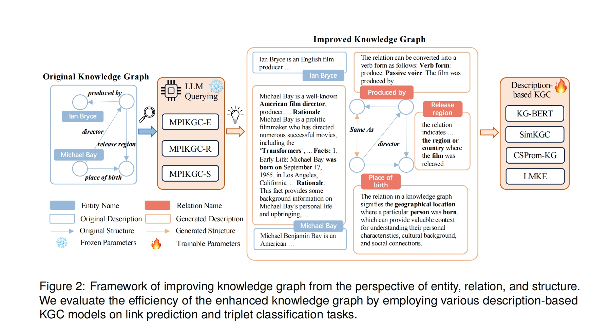

---

提出了MPIKGC的框架

- **实体描述扩展（MPIKGC-E）**：通过Chain-of-Thought（CoT）提示策略，让LLMs逐步生成更全面的实体描述。

- **关系理解增强（MPIKGC-R）**：使用全球、本地和反向提示策略，以提高KGC模型对关系的理解，从而改善链接预测的准确性。

- **结构信息提取（MPIKGC-S）**：利用LLMs的总结能力，从实体描述中提取关键词，基于匹配分数创建新的三元组，以丰富知识图谱的结构信息。

注：此论文给出了源代码和Prompt

---

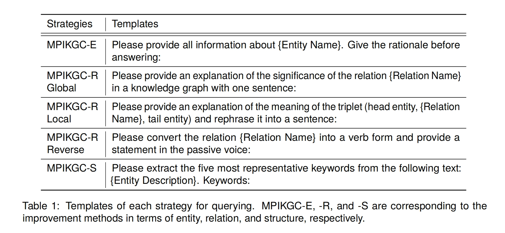

注：感觉可以和RAG结合

---

Do pre-trained models benefit knowledge graph completion? A reliable evaluation and a reasonable approach (ACL, 2022) [[paper\]](https://doi.org/10.18653/v1/2022.findings-acl.282)

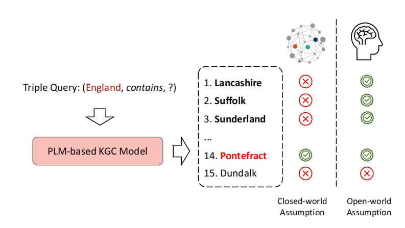

---

Dipping plms sauce: Bridging structure and text for effective knowledge graph completion via conditional soft prompting (ACL, 2023) [[paper\]](https://aclanthology.org/2023.findings-acl.729/)

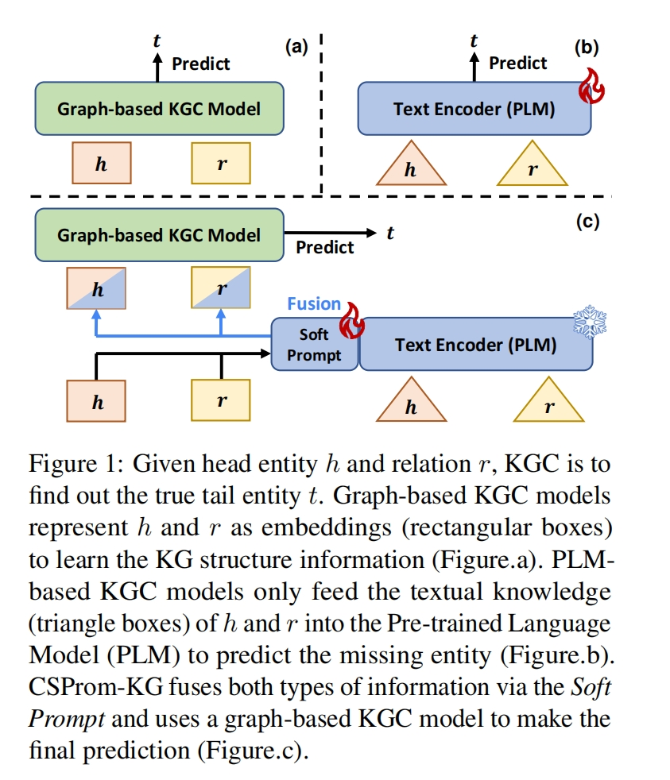

---

目标：*Can we effectively fuse the KG structural information into the PLM-based KGC models?*

方法：we propose a novel CSProm-KG model (**C**onditional **S**oft **Prom**pts for **KG**C) which is a structure-aware frozen PLMs that could effectively complete the KGC task

---

KG-BERT: BERT for knowledge graph completion (Arxiv, 2019) [[paper\]](http://arxiv.org/abs/1909.03193)

Multi-task learning for knowledge graph completion with pre-trained language models (COLING, 2020) [[paper\]](https://doi.org/10.18653/v1/2020.coling-main.153)

> 优化了KG-BERT

Joint language semantic and structure embedding for knowledge graph completion (COLING, 2022) [[paper\]](https://aclanthology.org/2022.coling-1.171)

---

LLM-augmented KG-to-Text Generation近几年好像没有什么很新的工作。是不是都往RAG跑了？

以前的工作基本都是预训练，现在我们有没有能力预训练？效果如何？很难说。

<!--## Question-->

<!--1. LLM过程是否需要用卡？-->

<!--2. KG转化的过程需要多大的算力？-->

<!--Aminer-->

<!--**要点**：-->
<!--本文介绍了AMiner，一个在线学术搜索和挖掘系统，旨在帮助研究人员和科学家深入理解由作者、论文、会议、期刊和组织形成的庞大且异构的网络。AMiner系统能够自动从互联网上提取研究人员的个人资料，并通过姓名消歧后与发表的论文进行整合。系统采用了一种生成性概率模型来同时建模不同的实体，并提供主题级别的专业搜索。此外，AMiner还提供了一系列以研究者为中心的功能，包括社交影响分析、关系挖掘、合作推荐、相似性分析和社区演化。自2006年以来，AMiner系统一直在运行，并且已经被来自200多个国家和地区的超过800万独立IP地址访问。-->

<!--**方法**：-->
<!--AMiner系统主要包含五个组件：提取、整合、存储与访问、建模和服务。系统首先通过互联网自动提取研究人员的个人资料，然后通过一个统一的方法处理不同来源的信息，包括姓名消歧问题。接着，系统使用Jena工具存储和检索本体数据，并采用倒排索引方法来促进信息检索。建模部分则利用生成性概率模型同时建模不同类型的信息源，并估计与不同信息源相关联的主题分布。最后，服务部分基于建模结果提供多项功能，如个人资料搜索、专家发现、会议分析、课程搜索、子图搜索、主题浏览器、学术排名和用户管理。-->

<!--**实验**：-->
<!--文章中提到了AMiner系统在处理姓名消歧问题时采用了一个综合框架，该框架结合了全局和局部信息，并提出了一种端到端的聚类大小估计方法。此外，还涉及了人类标注者参与消歧过程以提高准确性。AMiner系统已经部署在处理十亿级别的姓名消歧问题上，证明了其有效性和效率。文章中还提到了AMiner收集了超过1.3亿研究人员资料和2.33亿篇出版物的大型学者数据集，以及为不同研究目的构建的多个子集，包括引文网络、学术社交网络、导师-学生关系、主题-合作者、主题-论文-作者、主题-引文、核心社区、动态合作者、专家发现和关联搜索等数据集。-->

<!--**实例**：-->
<!--文章中给出了“数据挖掘”查询的专家搜索结果示例，展示了如何通过AMiner系统找到特定领域的专家，并推荐相关的顶级会议和论文。例如，对于“数据挖掘”这一查询，系统不仅返回了该领域的专家列表，还推荐了相关的顶级会议和排名靠前的论文。-->

<!--**摘要**：-->
<!--AMiner是一个新颖的在线学术搜索和挖掘系统，它旨在提供系统化的建模方法，帮助研究人员和科学家深入理解由作者、论文、会议、期刊和组织构成的大型异构网络。该系统能够自动从网络上提取研究人员的个人资料，并通过姓名消歧的方式与发表的论文进行整合。AMiner还提供了一系列以研究者为中心的功能，如社交影响分析、关系挖掘、合作推荐、相似性分析和社区演化。自2006年以来，AMiner系统一直在运行，并且已经被来自200多个国家和地区的超过800万独立IP地址访问。-->

<!--**引言**：-->
<!--在过去的十年中，包括Google Scholar、Microsoft Academic、Semantic Scholar、ResearchGate和Academia.edu在内的各种学术社交网络网站越来越受欢迎。这些系统的共同目标是为研究人员提供一个集成的平台，用于查询学术信息和资源，分享自己的成就，并与其他研究人员建立联系。尽管这些系统已经集成了大量的学术资源，并提供了丰富的搜索和查询社交网络功能，但它们并没有进行系统的语义级分析或挖掘。因此，AMiner系统的主要目标是提供统一的建模方法，以获得对由作者、论文、会议、期刊和组织组成的大型异构学术网络中语义连接的更深入的理解。-->

---

<h1>Aminer MRT</h1>

## Aminer 技术路径

The system mainly consists of five components:

1) Extraction. 
2) Integration.
3) Storage and Access.
4) Modeling.
5) Services.

## AminerQuestion

Aminer是 researcher-centered ，我们应该是 Work-centric的

## MRT技术路径

[THUDM/MRT at mrtframework (github.com)](https://github.com/THUDM/MRT/tree/mrtframework)

[Semantic Scholar Academic Graph API | Semantic Scholar](https://www.semanticscholar.org/product/api)

- SemanticScholar as data source.

---

## MRT论文

> In this work, we propose a framework named **M**aster **R**eading **T**ree (MRT) to generate the *evolution roadmap*, which mainly contains two parts:
>
> (1) **Calculating Embeddings** To gain a deep comprehension for all publications and analyzing their relations, we generate expressive representations encoding both textual and structural information. A combination of document embedding and graph embedding is proposed in unsupervised styles.
>
> (2) **Constructing Roadmaps** After projecting publications into latent vector spaces, we apply clustering and automatic labeling techniques to build *evolution roadmap* based on pre-computed representations.

---

---

### **Calculating Embeddings**

build *evolution roadmaps* only based on the metadata of papers

## Other Works

[rahulnyk/knowledge_graph: Convert any text to a graph of knowledge. This can be used for Graph Augmented Generation or Knowledge Graph based QnA (github.com)](https://github.com/rahulnyk/knowledge_graph)

[开放图谱 �C 开放知识图谱 (openkg.cn)](http://openkg.cn/datasets-type/)

[Science Knowledge Graph (SciKG)  (~1000 concepts, 200,000 experts, 500,000 publications) | AMiner](https://www.aminer.cn/scikg)

[AMiner - AI赋能科技情报挖掘](https://mrt.aminer.cn/)

[THUDM/MRT: MRT: Tracing the Evolution of Scientific Publications (TKDE 2021) (github.com)](https://github.com/THUDM/MRT)

[唐杰 - Department of Computer Science and Technology, Tsinghua University | 人才画像 - AMiner](https://www.aminer.cn/profile/Jie Tang/53f46a3edabfaee43ed05f08)

[AMiner open-academic-graph](https://www.aminer.cn/oag)

[Open Academic Graph - Microsoft Research](https://www.microsoft.com/en-us/research/project/open-academic-graph/)

[抽取库 LambdaKG DeepKE Documentation ― DeepKE 0.2.97 documentation](https://www.zjukg.org/DeepKE/index.html)

[描述了github开发者之间的follow关系 - torch_geometric.datasets.GitHub ― pytorch_geometric documentation](https://pytorch-geometric.readthedocs.io/en/latest/generated/torch_geometric.datasets.GitHub.html#torch_geometric.datasets.GitHub)

> 开放学术图谱（Open Academic Graph，OAG）是一个大型的学术知识图谱，连接了两个亿级学术图谱：**微软学术图谱（Microsoft Academic Graph，MAG）和清华大学的AMiner学术图谱**，致力于提供完全开放、免费的公开学术图谱。具体来说，OAG包含了来自MAG的超过1.66亿篇学术论文和来自AMiner的近1.55亿篇论文的元数据信息。经过集成这些数据信息，OAG生成了两个学术图谱之间近6500万对链接（匹配）关系。

<!--大知识图谱->小知识图谱-->

---

## 备用思路

在GitHub上，两个库（repository）之间可以存在多种关系，除了常见的fork关系外，还有以下几种：

> 1. **依赖关系**：
>    - 一个库可能依赖于另一个库，通常通过包管理器（如npm、pip、Maven等）指定。
>    - 依赖关系可以在项目的配置文件中找到，如`package.json`、`requirements.txt`等。
>
> 2. **子模块（Submodule）**：
>    - 一个库可以将另一个库作为子模块包含在内。
>    - 子模块允许在一个Git仓库中嵌入另一个Git仓库，常用于共享代码库。
>
> 3. **引用（Reference）**：
>    - 一个库可能在代码、文档或README中引用另一个库。
>    - 这种引用可以是直接的链接、文档说明或代码示例。
>
> 4. **贡献者关系**：
>    - 开发者可能在多个库中贡献代码，形成间接的库间关系。
>    - 通过查看贡献者列表，可以发现哪些开发者在多个相关库中活跃。
>
> 5. **依赖图（Dependency Graph）**：
>    - GitHub提供的依赖图功能可以显示一个库的依赖关系和被依赖关系。
>    - 这可以帮助识别库之间的依赖链。
>
> 6. **共同使用的工具或框架**：
>    - 两个库可能使用相同的工具、框架或库，形成间接的技术关联。
>    - 例如，两个库都使用React或Django。
>
> 7. **组织关系**：
>    - 两个库可能属于同一个GitHub组织。
>    - 组织通常用于管理相关项目和团队成员。
>
> 8. **主题（Topics）**：
>    - GitHub允许为库添加主题标签，两个库可能共享相同的主题。
>    - 这可以帮助用户发现相关项目。
>
> 9. **Pull Request和Issue**：
>    - 一个库可能在另一个库中提交过Pull Request或Issue。
>    - 这种交互可以反映库之间的协作或依赖。
>
> 10. **镜像（Mirror）**：
>     - 一个库可能是另一个库的镜像，通常用于备份或分发目的。
>
> 这些关系可以通过GitHub的API、界面或工具进行分析和识别。了解库之间的关系有助于更好地理解项目的生态系统和协作模式。

1. 函数调用频率：

> 目标：统计项目中调用外部库函数的频率。
>
> 方法：使用AST解析代码，统计每个库的函数调用次数。
>
> 权重分配：调用次数越多，权重越高。

2. 使用GitHub的依赖关系图API

> 目标：GitHub提供了依赖关系图API，可以直接获取项目的依赖信息。
>
> 方法：使用GitHub API的依赖关系图端点获取信息。
>
> 工具：GitHub GraphQL API可以提供更详细的依赖信息。

要自动化检索某个GitHub库可能与哪些其他库有关系，可以从多个角度进行分析。以下是一些思路和步骤：

1. **分析README文件**：
   - **目标**：README文件通常包含项目的描述、使用说明和引用的其他库。
   - **方法**：使用GitHub API获取README内容，解析其中的链接和库名称。
   - **工具**：`get_readme()` 方法可以获取README文件。

2. **检查依赖文件**：
   - **目标**：项目的依赖文件（如`requirements.txt`、`package.json`、`Pipfile`等）列出了直接依赖的库。
   - **方法**：使用GitHub API获取这些文件的内容，解析其中的依赖项。
   - **工具**：`get_contents()` 方法可以获取特定文件。

3. **分析代码引用**：
   - **目标**：代码中可能直接引用其他库的代码或API。
   - **方法**：使用正则表达式或静态分析工具扫描代码文件，查找特定的库引用。
   - **工具**：`get_contents()` 方法获取代码文件，结合正则表达式进行分析。

4. **检查项目的依赖关系图**：
   - **目标**：一些项目可能在其文档中提供了依赖关系图。
   - **方法**：通过解析项目文档或使用工具生成依赖关系图。
   - **工具**：Graphviz等工具可以帮助可视化依赖关系。

5. **使用GitHub的依赖关系图API**：
   - **目标**：GitHub提供了依赖关系图API，可以直接获取项目的依赖信息。
   - **方法**：使用GitHub API的依赖关系图端点获取信息。
   - **工具**：GitHub GraphQL API可以提供更详细的依赖信息。

6. **分析项目的贡献者和分支**：
   - **目标**：查看项目的贡献者和分支，可能揭示与其他项目的关系。
   - **方法**：使用GitHub API获取贡献者和分支信息，分析其与其他项目的交集。
   - **工具**：`get_contributors()` 和 `get_branches()` 方法。

7. **利用社交编码平台**：
   - **目标**：平台如GitHub的社交功能可以揭示项目之间的关系。
   - **方法**：分析项目的fork、star、watch等社交活动。
   - **工具**：GitHub API提供了相关的端点。

8. **使用自然语言处理（NLP）技术**：
   - **目标**：通过NLP技术分析项目文档和代码注释，识别潜在的库关系。
   - **方法**：使用NLP库（如spaCy、NLTK）解析文本，提取实体和关系。
   - **工具**：NLP库结合GitHub API获取的文本数据。

要分析一个GitHub库对其他库的依赖程度，并为这些依赖关系分配权重，可以从多个角度进行分析。以下是一些思路和步骤：

1. **代码行数分析**：
   - **目标**：计算项目中每个依赖库的代码行数使用情况。
   - **方法**：扫描代码文件，统计每个库的导入语句和使用频率。
   - **工具**：使用正则表达式或静态分析工具解析代码。

2. **函数调用频率**：
   - **目标**：分析项目中调用外部库函数的频率。
   - **方法**：使用静态分析工具或AST（抽象语法树）解析，统计每个库的函数调用次数。
   - **工具**：Python的`ast`模块可以帮助解析和分析代码。

3. **依赖文件权重**：
   - **目标**：根据依赖文件（如`requirements.txt`）中指定的版本和依赖关系，分配权重。
   - **方法**：分析依赖文件，结合版本信息和依赖关系图，评估每个库的重要性。
   - **工具**：使用`pipdeptree`等工具生成依赖关系图。

4. **运行时分析**：
   - **目标**：在运行时分析项目对外部库的调用。
   - **方法**：使用动态分析工具或插桩技术，记录运行时的库调用。
   - **工具**：`cProfile`、`line_profiler`等可以帮助分析运行时性能。

5. **代码覆盖率**：
   - **目标**：通过测试覆盖率分析，评估项目对外部库的依赖程度。
   - **方法**：运行测试套件，使用覆盖率工具分析每个库的覆盖情况。
   - **工具**：`coverage.py`可以生成详细的覆盖率报告。

6. **贡献者分析**：
   - **目标**：分析项目贡献者的背景，评估对外部库的依赖。
   - **方法**：使用GitHub API获取贡献者信息，分析其与其他库的交集。
   - **工具**：GitHub API提供了相关的端点。

7. **文档和注释分析**：
   - **目标**：通过分析项目文档和代码注释，识别对外部库的依赖程度。
   - **方法**：使用NLP技术解析文本，提取实体和关系。
   - **工具**：NLP库（如spaCy、NLTK）结合GitHub API获取的文本数据。

8. **权重计算**：
   - **目标**：为每个依赖库分配权重。
   - **方法**：结合以上分析结果，使用加权平均或其他统计方法计算权重。
   - **工具**：可以使用Python的`numpy`、`pandas`等库进行数据处理和分析。
